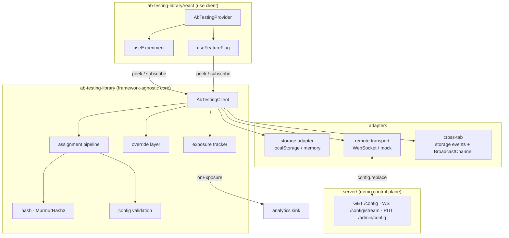
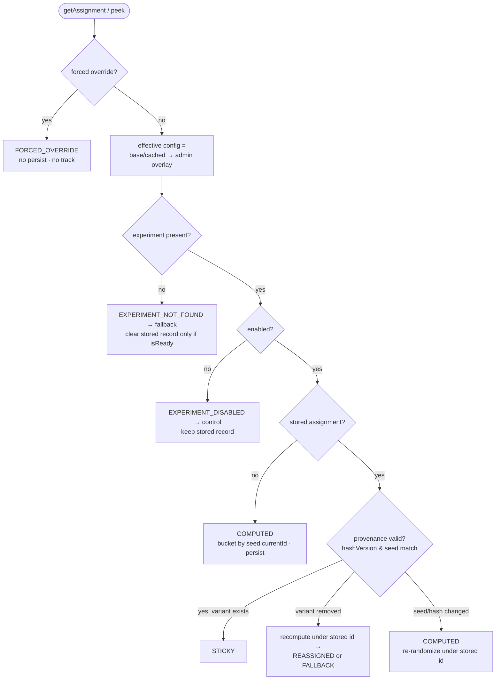
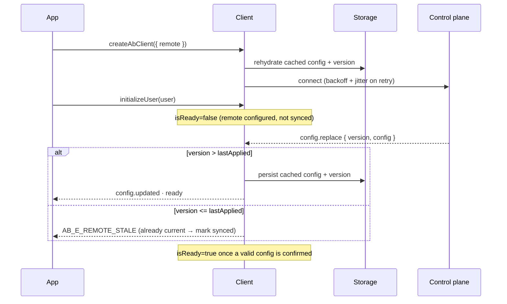

# Architecture

A framework-agnostic core surrounded by thin, swappable adapters, with React as one
consumer. The core never imports React; the backend is a separate demo control plane.

## Layers

The React adapter only ever calls the client's side-effect-free `peek*` reads during
render and `subscribe` for updates; it imports core *types* only, so the React bundle
carries no core runtime.

## Evaluation pipeline

`getAssignment(key)` is a single deterministic pipeline. Each branch maps to exactly one
runtime `reason` (and exposure eligibility). The pure function lives in
`src/core/assignment.ts`; the client applies the resulting persist/clear side effects.

**Provenance invariant.** A persisted assignment stores the inputs it was computed from
(`bucketingId`, `hashVersion`, `seed`). Stickiness holds only while those still match the
current config; any mismatch is detected and triggers a rule-based recompute. This is why
changing a split never churns already-assigned users, while changing a `seed` (or
`HASH_VERSION`) deliberately re-randomizes them.

## Identity & bucketing

- Randomization unit is `id`; `email` is in-memory only and never persisted or bucketed.
- No `id` → an anonymous id is generated (`crypto.randomUUID()` with a non-secure fallback).
- `anon → known` keeps existing assignments under their original `bucketingId`; new
  experiments use the known id. `known → different known` resets assignments.
- Recomputes use the *stored* `bucketingId` (identity continuity); first-time assignments
  use the current one. `bucketingId` is also the seam for a future server-side store.

## Remote config & readiness

Readiness: `uninitialized → initialized(bootstrap) → live(synced)`. With no remote,
ready == initialized. With a remote, ready flips once a valid `config.replace` confirms
sync — including a same-version snapshot that confirms the cached config is current.

## Cross-tab sync

A change persisted in one tab is signalled to others via `BroadcastChannel` (preferred)
and `storage` events (required path). Receivers re-read storage into memory only and never
write back, so there is no echo loop. Each tab keeps its own active user; only experiment
data (assignments, cached config/version) syncs.

## React store

Hooks subscribe via `useSyncExternalStore(subscribe, getSnapshot, getServerSnapshot)`:

- `getSnapshot` returns a per-key memoized, referentially-stable result (via the client's
  pure `peekAssignment` / `peekFeatureFlag`), so an unrelated experiment changing does not
  re-render the component.
- `getServerSnapshot` always returns the safe default → crash-free SSR/hydration; the
  store then reconciles to the live value after hydration.
- Render is pure; exposure fires from a post-commit `useEffect` (StrictMode's double
  invocation is absorbed by the in-memory dedupe).

## Packaging

`./` (core) and `./react` are independent entry points. React is an optional peer
dependency and is externalized from the build, so a non-React consumer never pulls React.
Built as dual ESM/CJS with per-condition `.d.ts` / `.d.cts`, `"sideEffects": false`, and
validated by `publint` + `arethetypeswrong`. Zero runtime dependencies.
